# animating-react

## Ch-01

- `useSpring` 终究返回的还是一个 `Object`
- 这个对象使用在组件的 `style` 属实上，但必须 `animated.div`包裹起来才能识别

```js
import { useSpring, animated } from 'react-spring';

const fade = useSpring({
  from: {
    opacity: 0,
  },
  to: {
    opacity: 1,
  },
});

// Shorter
// const fade0 = useSpring({from: { opacity:0 }, opacity: 1});

console.dir(fade);
// ------------------------
// Object:
//   opacity: AnimatedValue
//   payload: undefined
//   children: []
//   animatedStyles: Set(0) {}
//   value: 1
//   startPosition: 0
//   lastPosition: 1
//   lastVelocity: 0.008723350085529756
//   startTime: 1583214790073
//   lastTime: 1583214790849
//   done: true
//   setValue: ƒ (value, flush)
//   __proto__: Animated
//   __proto__: Object

return <animated.div style={fade}></animated.div>;
```

## Ch-02

> 简单的按钮控制显现

- 如果不写 `from` 和 `to` 的话，useSpring 有个默认的 `duration` 渐变

```js
import React, { useState } from 'react';
import { useSpring, animated } from 'react-spring';

const Toggle = () => {
  const [isToggle, setToggle] = useState(false);
  const fade = useSpring({
    opacity: isToggle ? 1 : 0,
  });

  return (
    <div>
      <animated.h1 style={fade}>Hello</animated.h1>
      <button onClick={() => setToggle(!isToggle)}>Button</button>
    </div>
  );
};

export default Toggle;
```

## Ch-03

```js
const fade = useSpring({
  // opacity: isToggle ? 1 : 0,
  // fontSize: isToggle ? '2rem' : '5rem',
  transform: isToggle ? 'translate3d(0,0,0)' : 'translate3d(0, -50px, 0)',
  color: isToggle ? 'tomato' : 'green',
});
```

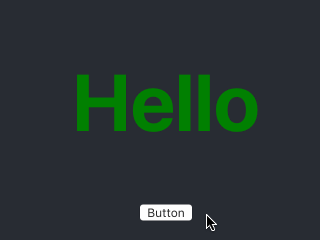
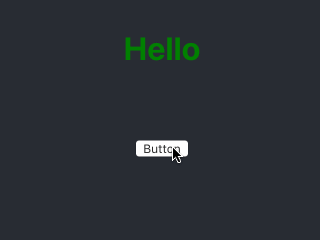

## Ch-04 interpolation

```js
// transform 不起作用，得用 interpolate
// ---- ❌❌ ----
const fade = useSpring({
  y: isToggle ? 0 : -50,
  color: isToggle ? 'tomato' : 'green',
});

<animated.h1
  style={{
    ...fade,
    transform: `translate3d(0,${fade.y},0)`,
  }}
>
  Hello
</animated.h1>;
// ---- ❌❌ ----
```

> 和 数值 相关的必须使用 interpolate 动态获取

```js
const Toggle = () => {
  const [isToggle, setToggle] = useState(false);
  const { y, color } = useSpring({
    y: isToggle ? 0 : -50,
    color: isToggle ? 'tomato' : 'green',
  });

  return (
    <div>
      <animated.h1
        style={{
          color,
          transform: y.interpolate(y => `translate3d(0,${y}px,0)`),
        }}
      >
        Hello
      </animated.h1>
      <button onClick={() => setToggle(!isToggle)}>Button</button>
    </div>
  );
};
```

## Ch-05 Nav

> 菜单打开动效，记得`Nav` 组件内部用 `animated` 包一下。

```js
const navAnimation = useSpring({
  transform: isNavOpen ? `translate3d(0,0,0) scale(1)` : `translate3d(100%,0,0) scale(0.6)`,
});

<Nav style={navAnimation} />;
```

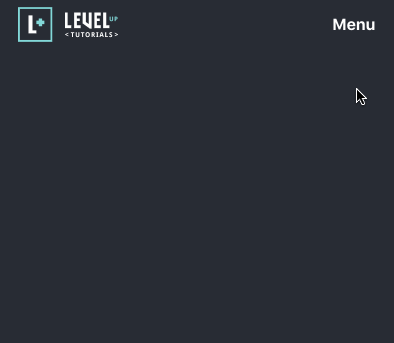

## Ch-06 Checkout

- 注意两处有 `tricks`
  - 第一处：`Checkout` 是 `fixed`布局，在视窗最上方且有绝对权重，导致在它下面的`按钮`点击事件没有效果，则需要单独处理 `pointerEvents: isOpen ? 'all' : 'none';`
  - 第二处：transform: x.interpolate(x => `translate3d(${-1 * x}%,0,0)`) 还是数值运动处理，使用 `interpolate`，和反向运动使用 `-1`

```js
const Checkout = ({ isOpen }) => {
  const { x } = useSpring({
    x: isOpen ? 0 : 100,
  });

  return (
    <div
      className="checkout"
      style={{
        pointerEvents: isOpen ? 'all' : 'none',
      }}
    >
      <animated.div
        style={{ transform: x.interpolate(x => `translate3d(${-1 * x}%,0,0)`) }}
        className="checkout-left"
      ></animated.div>
      <animated.div
        style={{ transform: x.interpolate(x => `translate3d(${x}%,0,0)`) }}
        className="checkout-right"
      ></animated.div>
    </div>
  );
};
```

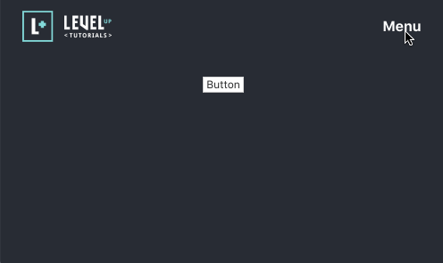

## Ch-07 Emulating Keyframes

> 模拟帧动画用 interpolate 的链式操作

```js
// ❎ y: isToggle ? -50 : 0,
// -> ✅ y: isToggle ? 0 : 1,

// 这里的 `interpolate` 是链式操作，对原先的值进行迭代

<animated.h1
  style={{
    color,
    opacity,
    transform: y
      .interpolate({
        range: [0, 0.25, 0.5, 0.75, 1],
        output: [0, -25, -50, -100, -50],
      })
      .interpolate(y => `translate3d(0,${y}px,0)`),
  }}
>
  Hello
</animated.h1>
```

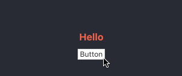

## Ch-08 Transition with mounting

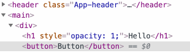

```js
const transtion = useTransition(isToggled, null, {
  from: { opacity: 0 },
  enter: { opacity: 1 },
  leave: { opacity: 0 },
});
// 感觉真不好用
return {transtion.map(({item, key, props}) => item && <animated.h1 key={key} style={props}>Hello</animated.h1>)}
```

## Ch-09 Transition with multiple

> 感觉 transition 用于批量元素的动画

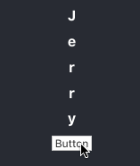

```js
{transtion.map(
  ({ item, key, props }) =>
    item && (
      <animated.h1 key={key} style={props}>
        {item.letter}
      </animated.h1>
    )
)}
```

## Ch-10 Trasition with router

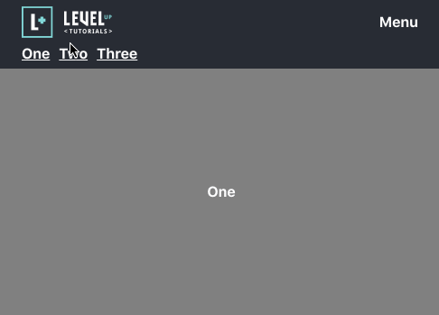

## Ch-11 Trasition with modal

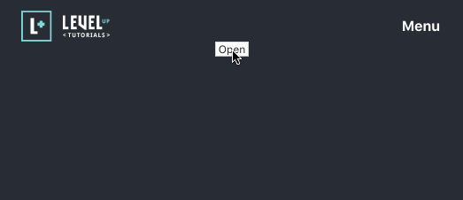

- 小技巧：`const pointerEvents = on ? 'all' : 'none';` 不要遮挡 Menu 的点击事件
- 原来 `style` 的样式 `pointerEvents`，可以传递下去，真巧妙 `style={{ pointerEvents }}`
- 设计大原来没有后来有的问题，统统用 `useTransition`，相当于 `mounting` 和 `unmounting`
- modal-card 有个从上往下掉的效果 `translate3d(0, -50px, 0)`

```css
.modal {
  position: fixed;
  width: 100%;
  display: flex;
  top: 0;
  left: 0;
  justify-content: center;
  align-items: center;
  height: 100vh;
}
```

```js
const Modal = ({ closeModal, animation, pointerEvents }) => {
  return (
    <div className="modal" style={{ pointerEvents }}>
      <animated.div className="modal-card" style={animation}>
        <button onClick={closeModal}>Close</button>
        <h1>Modal</h1>
      </animated.div>
    </div>
  );
};

const ModalWrapper = () => {
  const [on, toggle] = useState(false);
  const transition = useTransition(on, null, {
    from: { opacity: 0, transform: 'translate3d(0, -50px, 0)' },
    enter: { opacity: 1, transform: 'translate3d(0, 0, 0)' },
    leave: { opacity: 0, transform: 'translate3d(0, -50px, 0)' }
  });

  const pointerEvents = on ? 'all' : 'none';

  return (
    <div>
      {transition.map(
        ({ item, key, props: animation }) =>
          item && (
            <Modal
              pointerEvents={pointerEvents}
              animation={animation}
              closeModal={() => toggle(false)}
            />
          )
      )}
      <button onClick={() => toggle(!on)}>Open</button>
    </div>
  );
};
```

## Ch-12 Accordion

- `useMeasure`

```js
const Accordion = () => {
  const [on, toggle] = useState(false);
  // const [bind, measure] = useMeasure();
  // console.dir(bind)
  // console.dir(measure);
  const [bind, measure] = useMeasure();
  const { height, top } = measure || {};
  console.log(measure)
  const animation = useSpring({
    overflow: 'hidden',
    // + wrapper的padding
    height: on ? height + top * 2 : 0,
  });


  return (
    <div>
      <h1 onClick={() => toggle(!on)}>Toggle</h1>
      <animated.div style={animation}>
        <div {...bind} className="accordion">
          <p>Hello, i'm in the accordion</p>
        </div>
      </animated.div>
    </div>
  );
};

/*
bind: {
  ref: {current: undefined}
}

measure: {
  x: 23  // 盒子内容距离视窗边框的距离
  y: 23  // 就是 padding 值
  width: 1782
  height: 62 // height = 上下padding和盒子内容高度
  top: 23
  right: 1805
  bottom: 85
  left: 23
}
*/
```

- 动态尺子：返回的bounds是个动态值，会根据视窗大小自动更新触发动画效果

```js
export default function useMeasure() {
  const ref = useRef();
  const [bounds, set] = useState({ left: 0, top: 0, width: 0, height: 0 });
  const [ro] = useState(
    () => new ResizeObserver(([entry]) => set(entry.contentRect))
  );
  useEffect(() => (ro.observe(ref.current), ro.disconnect), []);
  return [{ ref }, bounds];
}
```

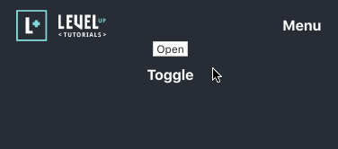

## Ch-13 animation on scroll

### react-wayponit

- onEnter 实现的触发：其包裹的容器完全展露后才触发！

```js
const Waypoints = () => {
  const [on, toggle] = useState(false);
  const animation = useSpring({
    opacity: on ? 1 : 0,
    // 当该容器完全展露头角时，由左向右滑动展示，初始位置50%
    transform: on ? 'translate3d(0,0,0)' : 'translate3d(50%, 0, 0)',
    config: config.molasses,
  });

  return (
    <div className="waypoints">
      <p>
        Lorem ipsum dolor amet poutine pitchfork tattooed venmo, heirloom cliche chartreuse gentrify
        mumblecore hammock single-origin coffee banh mi. Sartorial unicorn 90's edison bulb iPhone.
        Leggings pickled brunch neutra tousled. Occupy fixie affogato pinterest vaporware aesthetic,
        tbh subway tile hammock next level prism vape lomo taiyaki kale chips. Jianbing knausgaard
        taxidermy squid artisan thundercats, gochujang subway tile air plant taiyaki master cleanse
        cray.
      </p>
      <div>
        <Waypoint
          /* 尾部还差15%就进入 onEnter 事件 */
          bottomOffset="15%"
          onEnter={() => {
            if (!on) toggle(true);
          }}
        />
        <animated.p style={animation}>
          Jianbing lomo lumbersexual put a bird on it fixie next level pitchfork gentrify, disrupt
          echo park. Hot chicken subway tile drinking vinegar fixie. YOLO keytar gluten-free artisan
          live-edge four loko cred man braid food truck leggings. Health goth semiotics kogi
          heirloom authentic hell of. Pork belly helvetica cornhole gentrify microdosing austin
          chillwave pitchfork paleo cred raclette venmo vegan fashion axe +1.
        </animated.p>
      </div>
      <p>
        Craft beer tousled ennui ugh, williamsburg stumptown flexitarian plaid activated charcoal.
        Taxidermy letterpress glossier 8-bit, organic bitters coloring book. Selvage lo-fi
        typewriter wolf ugh, lyft four loko chillwave bitters mustache tumblr copper mug subway
        tile. Fanny pack aesthetic taiyaki vice sustainable mustache. Asymmetrical shabby chic DIY
        authentic normcore man braid you probably haven't heard of them. Mustache humblebrag umami
        beard williamsburg. Prism hexagon VHS, paleo tacos narwhal etsy fashion axe ennui schlitz
        ethical echo park vinyl.
      </p>
    </div>
  );
};
```

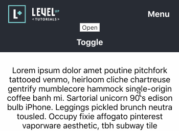

## Ch-14 set function & gesture

```js

const Gesture = () => {
  const [{ xy }, set] = useSpring(() => ({ xy: [0, 0] }));

  // 这里down表示鼠标按键是否按下ing
  // 这里delta是个偏移量，表示光标下落点的坐标相对xy轴偏移了多少，是个[0,0] 的数组
  const bind = useGesture(({ down, delta }) => {
    // 按着鼠标没，按着就设偏移量
    set({ xy: down ? delta : [0, 0] });
  });
  return (
    <animated.div
      style={{
        transform: xy.interpolate((x,y) => `translate3d(${x}px, ${y}px, 0)`),
      }}
      {...bind()}
      className="box"
    />
  );
};
```

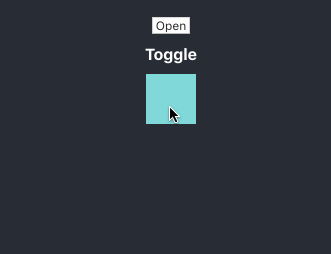
